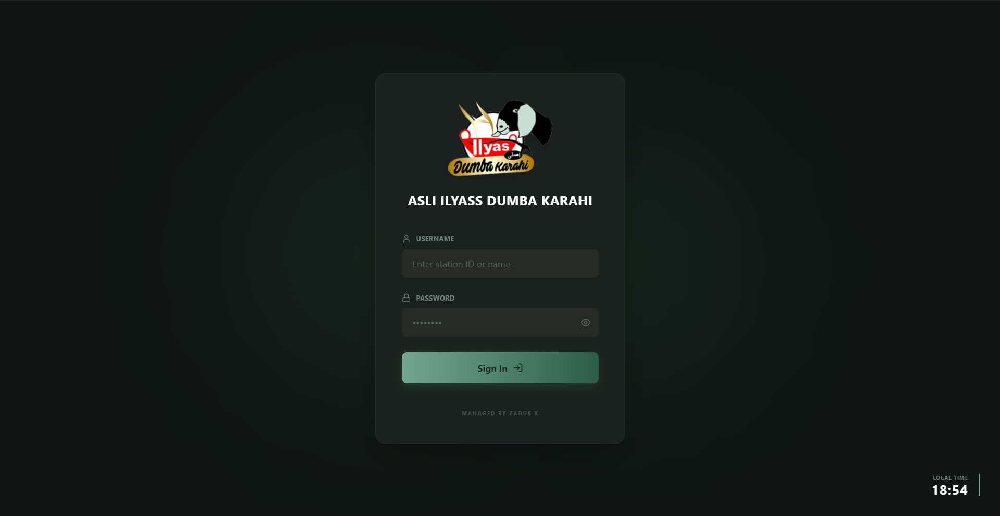

  <h1>🚀 Next-Gen Offline Point of Sale (POS) System</h1>
  
<b>An ultra-reliable, zero-latency desktop POS built for high-volume restaurants.</b>

  
  
  
  
  

---

## 📖 Overview

Designed specifically for fast-paced, high-volume restaurant environments, this POS system prioritizes **unbreakable reliability and speed**. By operating on a strictly "Offline-First" local architecture, it eliminates the dependency on internet connections, ensuring cashiers can process orders with zero latency. 

It serves as both a rapid-checkout terminal for front-of-house staff and a comprehensive analytics/HR dashboard for restaurant owners.

 

  <!-- Place your main POS screenshot here -->
  
  
<i>The intuitive, high-speed cashier terminal with multi-tab support.</i>

---

## ✨ Comprehensive Feature List

This application is packed with over 40+ production-grade features divided across Cashier Operations, Management Analytics, HR, and System Architecture.

### 🛒 1. Cashier POS Terminal
The front-of-house interface is optimized for speed and touchscreen usability.
* **Visual Menu Grid:** Items display with uploaded images or auto-generate colored initial avatars.
* **Real-Time Search:** Instant keyword search bar to locate menu items without latency.
* **Category Chips:** Horizontal scrolling filters for rapid category switching (e.g., BBQ, Drinks).
* **Multi-Tab "Hold Order" System:** Cashiers can open multiple independent tabs to "park" an order (if a customer forgets their wallet) and serve the next customer instantly.
* **Independent Tab States:** Each parked tab retains its own cart, assigned waiter, and payment state.
* **Auto-Closing Tabs:** Tabs automatically close and clear from the UI upon successful checkout.
* **Order Flow Logic:** Hard toggles for "Dine In" vs. "Takeaway".
* **Mandatory Waiter Assignment:** The system forces the cashier to assign a waiter if "Dine In" is selected, preventing untracked table service.
* **Dynamic Tax Engine:** Automatically applies contextual taxes (e.g., standard GST for cash, discounted GST for digital payments).
* **Discount Application:** One-click dropdown to apply owner-defined percentage discounts to the subtotal.
* **Change Calculator:** Cashiers input the physical cash handed to them, and a high-visibility UI badge instantly displays the exact Change Due.
* **Cart Management:** Adjust quantities (+/-), delete single items, or trigger a master "Empty Cart" reset.
* **Silent Auto-Printing:** Communicates directly with the Windows Print API to instantly generate thermal receipts without browser print dialogues.

### 👑 2. Owner Analytics Dashboard
A secure, pin-protected hub for high-level restaurant management.
* **Custom Date Range Filtering:** View analytics for Today, Past 7 Days, Past 30 Days, All Time, or specific custom dates.
* **KPI Tracking:** Top-level metrics for Total Revenue, Total Orders, Average Order Value (AOV), and Total Tax Collected.
* **Revenue Ratios:** Visual progress bars comparing Dine-In vs. Takeaway revenue splits.
* **Peak Hour Traffic Analysis:** Algorithmically calculates the top 5 busiest hours of the day to assist with staff scheduling.
* **Bestsellers Ranking:** Tracks and ranks the top 5 items by total revenue and units sold.
* **Dead Stock Flagging:** Automatically highlights items with exactly 0 sales in the selected timeframe so owners can prune the menu.
* **1-Click Excel Export:** Instantly dump raw sales data into a CSV/Excel file for accounting.

### 👥 3. HR & Attendance Module
Replaces the need for standalone biometric systems.
* **Daily Staff Register:** A calendar interface to mark staff as Present, Absent, Late, or on Leave.
* **Automated Penalty Mathematics:** Automatically calculates a staff member's total absences by applying custom rules (e.g., *3 Lates = 1 Absent*).
* **Cashier & Waiter Management:** Separate roster controls for system-access users (Cashiers) vs. floor staff (Waiters).
* **Monthly HR Exports:** Dedicated 1-click button to download the current month's attendance sheet for payroll processing.

### 📦 4. Inventory & Stock Ledger
* **Raw Material Logging:** Manually log raw ingredient purchases (Item Name, Quantity, Total Cost).
* **Daily Expense Tracking:** Displays total daily cash outlays against revenue.
* **Historical Expense Reports:** Downloadable ledgers for stock auditing.

### ⚙️ 5. Menu & System Configuration
* **Dynamic Branding:** Upload a custom Restaurant Logo and update the business name to globally rebrand the UI and printed receipts.
* **Menu Control:** Full CRUD (Create, Read, Update, Delete) for Categories and Menu Items.
* **Inactive Item Toggles:** Temporarily hide out-of-stock items from the cashier view without deleting historical data.
* **Custom Discount Manager:** Create unique percentage-based discounts (e.g., "Staff Meal 50%", "Police 100%").
* **Hardware Targeting:** Select and lock the default Windows thermal printer for the terminal.
* **Setup Wizard:** A guided first-time execution flow that creates accounts, initializes the database, and pre-seeds a default menu.

 

  <!-- Place your dashboard screenshot here -->
  
  
<i>The Owner's analytical dashboard tracking revenue and staff attendance.</i>

---

## 🏗️ Technical Architecture & Engineering Decisions

This application was engineered to bypass common pitfalls of desktop web-wrappers.

* **Frontend Layer:** Built with **React 18** and **Vite** for incredibly fast component rendering, styled entirely with **Tailwind CSS** for a lightweight footprint.
* **Desktop Wrapper:** **Electron** securely bridges the React UI with the underlying Windows OS via a strict, isolated `preload.js` context bridge.
* **The WebAssembly Database (sql.js):** 
  * *The Problem:* Standard Node SQLite libraries rely on native C++ bindings, which notoriously fail during installation on different Windows machines due to missing DLLs or Visual Studio build tools.
  * *The Solution:* This project utilizes a WebAssembly (WASM) compilation of SQLite. It runs pure JavaScript in memory, ensuring the generated `.exe` can be installed on **any** Windows 10/11 machine instantly, with zero missing dependency errors.
* **Crash-Proof Atomic Transactions:** Orders are saved via strict SQL `BEGIN TRANSACTION` and `COMMIT` blocks. If the terminal loses power mid-save, the engine executes an automatic `ROLLBACK` to prevent corrupted database rows.
* **Asynchronous Debounced Writes:** Because the WASM database operates in RAM, data must be saved to the physical disk. To prevent extreme UI locking/freezing during rapid cashier checkouts, the write-engine is debounced. It waits for 1,000ms of inactivity before asynchronously flushing the database file to the hard drive, keeping the UI perfectly smooth.

---

  
<i>Note: Source code is proprietary and closed-source. This repository serves as an architectural showcase.</i>

